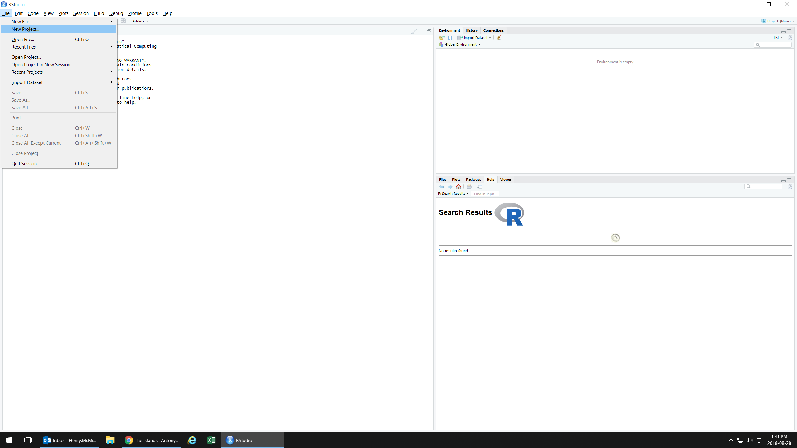
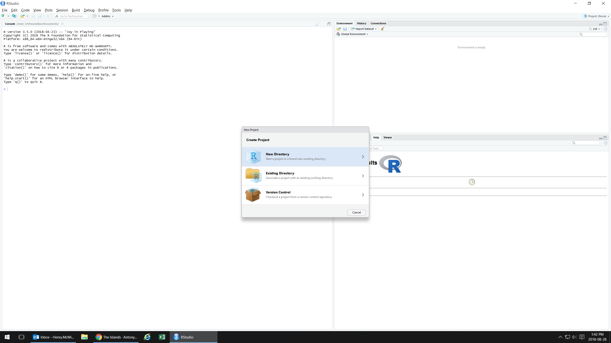
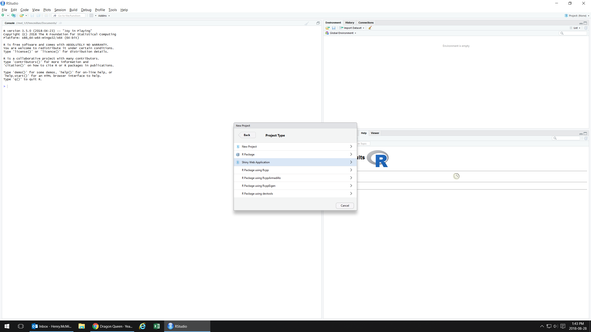
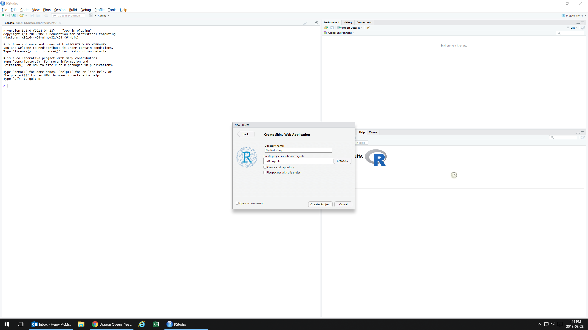
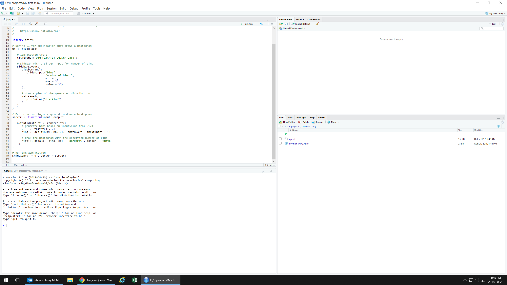
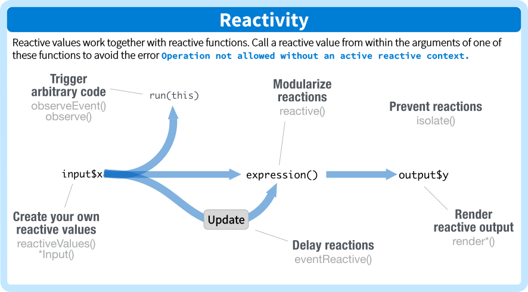

```{r setup, include=FALSE}
knitr::opts_chunk$set(echo = FALSE)

if(!require(pacman)) install.packages("pacman")
pacman::p_load(leaflet, plotly, shiny)

```

## Today's Workshop

 - What you can do with Shiny
 - Starting a shiny app
 - Adding features
 - HTMLwidgets
 - Deployment


# What can you do with Shiny?

----
```{r shiny}

shinyApp(ui = pageWithSidebar(
  headerPanel('Iris k-means clustering'),
  sidebarPanel(
    selectInput('xcol', 'X Variable', names(iris)),
    selectInput('ycol', 'Y Variable', names(iris),
                selected=names(iris)[[2]]),
    numericInput('clusters', 'Cluster count', 3,
                 min = 1, max = 9)
  ),
  mainPanel(
    plotOutput('plot1')
  )
), 
server = function(input, output, session) {

  # Combine the selected variables into a new data frame
  selectedData <- reactive({
    iris[, c(input$xcol, input$ycol)]
  })

  clusters <- reactive({
    kmeans(selectedData(), input$clusters)
  })

  output$plot1 <- renderPlot({
    palette(c( "#66bcdb", "#78a22f", "#e0b123", "#a52828", "#265a9a", "#4d7028", "#f15a25", "#8956a3" ))

    par(mar = c(5.1, 4.1, 0, 1))
    plot(selectedData(),
         col = clusters()$cluster,
         pch = 20, cex = 3)
    points(clusters()$centers, pch = 4, cex = 4, lwd = 4)
  })

})

  

```


## 
<div style="margin-top:-90px">
```{r plotly}

font.form <- list(
  family = "arial",
  size = 14,
  color = 'white')

plot_ly(z = ~volcano, width = 980, height = 700, showscale = FALSE) %>%
  add_surface() %>%
  layout(plot_bgcolor = "rgba(0, 0, 0, 0)") %>%
  layout(paper_bgcolor = "rgba(0, 0, 0, 0)") %>%
  layout(font = font.form) 
  

```


----
<div style="margin-top:-30px; height:100%">
```{r leaflet, out.height = '200%'}

df <- data.frame(
    lon = c(144.956795, 149.133884),
    lat = c(-37.817525, -35.306020),
    lab = c("Melbourne cRumpet", "Canberra cRumpet")
  )


leaf <- {
  
  m <- leaflet(height = "100%")
  m <- addTiles(m)
  m <- addMarkers(
    m, 
    lng   = df$lon, 
    lat   = df$lat, 
    popup = df$lab, 
    
    icon  = makeIcon(
      iconUrl     = "crumpet-lord.png",
      iconWidth   = 100,
      iconHeight  = 100,
      iconAnchorX = 50,
      iconAnchorY = 100
      )
    
    )
  
  m
    
}

fullheight_leafletOutput <- function(outputId, width = "100%", height = 550) htmlwidgets::shinyWidgetOutput(outputId, "leaflet", width, height, "leaflet")

htmlwidgets::shinyRenderWidget(substitute(leaf), fullheight_leafletOutput, parent.frame(), quoted = TRUE)


```

# Building a shiny app

##{.build}

<p style="text-align: center;"><strong><span style="font-size: 40.0pt; line-height: 107%;">shinyApp( <span style="color: #66bcdb;">ui</span> , <span style="color: #78a22f;">server</span>)</span></strong></p>

<table style='margin-top:60px;border-collapse:collapse;border:none;width:100%;'>
 <tr >
  <td valign=top width="50%" style="text-align:center;padding:40px;">
  
  <h2 style='margin-bottom:0cm;margin-bottom:.0001pt;line-height:
  normal'><span style='color:#66BCDB;'>ui</span></h2>
  
  <p style='margin-bottom:0cm;margin-bottom:.0001pt;line-height:
  normal'>The HTML frontend to your application –
  runs on the <br /> client computer</p>
  
  </td>
  
  <td valign=top width="50%" style="text-align:center;padding:40px;">
  
  <h2 style='margin-bottom:0cm;margin-bottom:.0001pt;line-height:
  normal'><span style='color:#78A22F'>server</span></h2>
  
  <p style='margin-bottom:0cm;margin-bottom:.0001pt;line-height:
  normal'>The R backend to your application – runs on your computer or server
  </p>
  
  </td>
 </tr>

</table>

<table style='border-collapse:collapse;border:none;width:100%;padding:40px;'>
 <tr>
 
 <td valign=top width="50%" style="text-align:center;padding:40px;">
  
  <p style='margin-bottom:0cm;margin-bottom:.0001pt;line-height:
  normal'><em>(A string of html)</em></p>
  
  </td>
  
   <td valign=top width="50%" style="text-align:center;padding:40px;">
  
  <p style='margin-bottom:0cm;margin-bottom:.0001pt;line-height:
  normal'><em>(An R function)</em></p>
  
  </td>
 
 </tr>
</table>


## The shiny directory
<div class="tg-wrap"><table><tr><td><strong style="background-color:#66bcdb;padding:10px">ui.r</strong></td><td>The user interface</td></tr><tr><td><strong style="background-color:#78a22f;padding:10px">server.r</strong></td><td>The server</td></tr><tr><td><strong style="background-color:#265a9a;padding:10px">global.r</strong></td><td>Defines objects available to UI and server</td></tr><tr><td><strong style="background-color:#f15a25;padding:10px">app.r</strong></td><td>Optional combination of UI and server</td></tr><tr><td><strong style="background-color:#8956a3;padding:10px">/www/</strong></td><td>UI assets (e.g. logo picture)</td></tr><tr><td><strong style="background-color:#a52828;padding:10px">...</strong></td><td>Additional files (e.g. datasets)</td></tr></table></div>

## Starting a new app

<div style="width: 100%; height: 420px; overflow: hidden">



## Starting a new app

<div style="width: 100%; height: 420px; overflow: hidden">



## Starting a new app

<div style="width: 100%; height: 420px; overflow: hidden">



## Starting a new app

<div style="width: 100%; height: 420px; overflow: hidden">



----

<div style="width: 100%; height: 555px; margin-top:-25px; overflow: hidden">



## UI layout

The basic container for your UI
```{R, echo = TRUE, eval = FALSE}
ui <- fluidPage()
```

A page title
```{R, echo = TRUE, eval = FALSE}
titlePanel("Old Faithful Geyser Data")
```

A page layout with a sidebar and a main panel
```{R, echo = TRUE, eval = FALSE}
sidebarLayout(
  sidebarPanel(),
  mainPanel()
  )
```


## UI features

A slider input with id "bins"
```{R, echo = TRUE, eval = FALSE}
sliderInput(
  inputId = "bins",
  label   = "Number of bins:",
  min     = 1,
  max     = 50,
  value   = 30
  )
```

A plot output with id "distplot"
```{r, echo = TRUE, eval = FALSE}
plotOutput(outputId = "distPlot")
```


## Server layout

Servers are always a function of input and output
```{R, echo = TRUE, eval = FALSE}
server <- function(input, output) {}
```

Get/assign inputs and output like named lists
```{R, echo = TRUE, eval = FALSE}
length.out = input$bins 
output$distPlot <- renderPlot()
```


## Server features

A reactive plot wrapper
```{R, echo = TRUE, eval = FALSE}
output$distPlot <- renderPlot({})
```

A simple R chart
```{R, echo = TRUE, eval = FALSE}
# generate bins based on input$bins from ui.R
x    <- faithful[, 2] 
bins <- seq(min(x), max(x), length.out = input$bins + 1)
      
# draw the histogram with the specified number of bins
hist(x, breaks = bins, col = 'darkgray', border = 'white')     
```

----
<div align="center">

</div>

# Adding features

## Adding a text input to the UI sidebar 
Add this:
```{r, echo = TRUE, eval = FALSE}
textInput("plottitle", "Enter a title for the plot")
```
Here:
```{r, echo = TRUE, eval = FALSE}
sidebarPanel(
         sliderInput("bins",
                     "Number of bins:",
                     min = 1,
                     max = 50,
                     value = 30), # < dont forget the comma
         
         ## ADD HERE ##
      )
```

## Adding a chart title in the server 
Add this argument:
```{r, echo = TRUE, eval = FALSE}
main = input$plottitle
```
to this function:
```{r, echo = TRUE, eval = FALSE}
hist(x, breaks = bins, col = 'darkgray', border = 'white')
```
